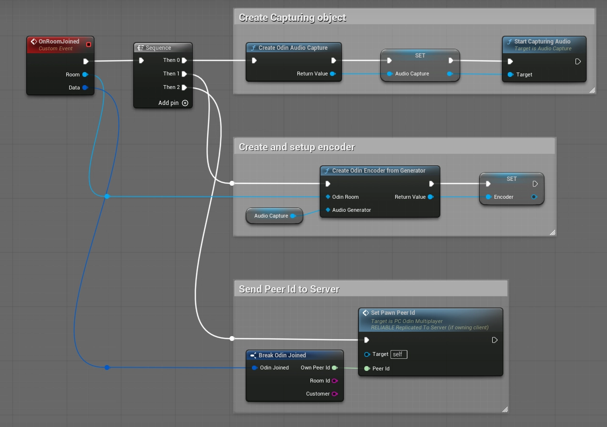
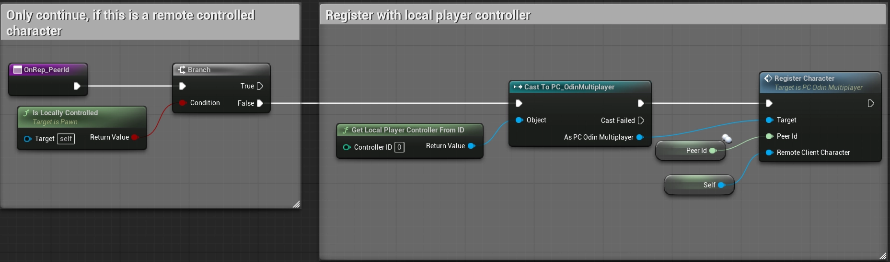
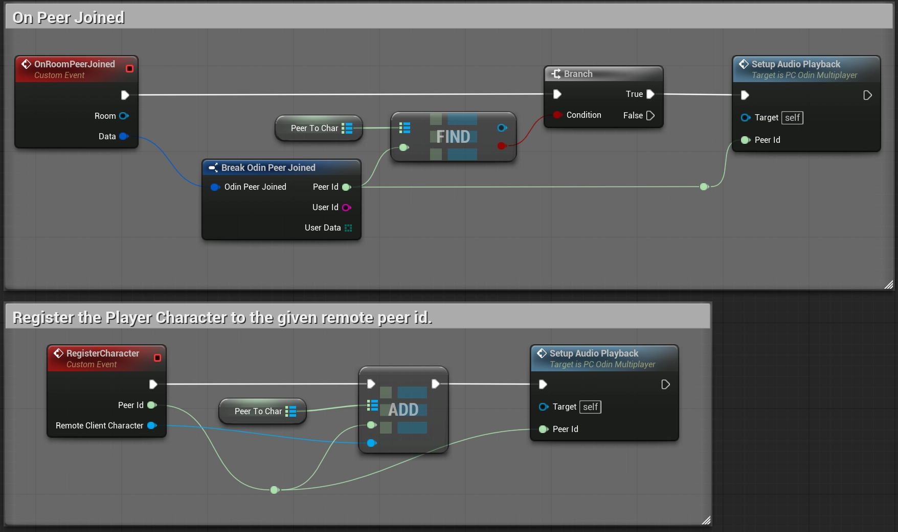
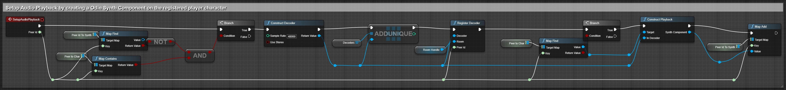
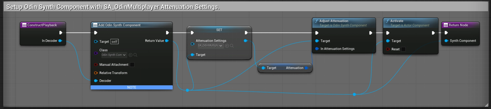

# Odin Integration Sample for Unreal Engine

This project offers a simple, yet comprehensive example showcasing the integration of the [ODIN Unreal SDK](https://github.com/4Players/odin-sdk) by [4Players](https://www.4players.io/company/about_us/) for Unreal Engine. For more in-depth information on replication and how to make Proximity Voice Chat work in Unreal, take a look at our [Odin Unreal Tutorial series on Youtube.](https://www.youtube.com/watch?v=MfZsbYhtUlU&list=PLAe4Im8mFTAuFFrFKnnl_MMJi8de7dYHs&index=2).

## Key Topics Showcased

This sample demonstrates the minimal amount of blueprints needed to use ODIN for both Global or Proximity Voice Chat on different platforms:

- Setting up Odin by creating a new room token, constructing a room handle and joining an Odin room
- Setting up Audio Capture for the local client and linking it to the Odin room.
- Connecting remote media streams to local playback with the Odin Synth Component and destroying local playback when a media stream gets disconnected.
- **Proximity Voice Chat:** Using RepNotify to synchronize Odin Peers with Unreal Characters. This makes Proximity Voice Chat possible in Multiplayer games.
- Handling Android Permissions.

## Getting Started

You'll need the latest Unreal Engine 5 release to start the minimal sample project. The Odin Unreal Plugin in general is compatible with Unreal versions starting with 4.26 - Odin 2 supports Unreal Engine 5.3 and onwards.

This repository uses [LFS](https://git-lfs.github.com) (large file storage) to manage pre-compiled binaries. Note that a standard clone of the repository might only retrieve the metadata about these files managed with LFS. In order to retrieve the actual data with LFS, please follow these steps:

1. Clone the repository:  
   ```
   git clone https://github.com/4Players/odin-unreal-minimal-samples.git
   ```

2. Cache the actual LFS data on your local machine and replace the metadata in the binary files with their actual contents: 
   ```
   git lfs fetch
   git lfs checkout
   ```
   ... or if you have a recent LFS version:
   ```
   git lfs pull
   ```

## Starting the Minimal Multiplayer Sample:

- Open the Map `Content > Odin > Maps > Odin_Multiplayer`
- In the Play-In-Editor options, change the `Number of Players` to more than 1.
- Set the `Net Mode` to `Play As Listen Server` or `Play As Client`

This will start the Editor in Multiplayer Mode and spawn the given number of Players. By walking to another Player Character, you will be able to hear yourself speaking from the Character's position, showcasing Proximity Voice Chat in Unreal. You can change the Proximity Voice behavior by adjusting the values in the Asset `Content > Odin > Multiplayer > SA_OdinMultiplayer`.

## Starting the Minimal Android Sample:

To test the project on Android, you'll need to adjust the Game Default Map, before packaging and copying a build to your device. Go to `Project Settings > Maps & Modes` and select the `Odin_AndroidMinimal` map as the Game Default Map. You're now ready to package and launch the project on your mobile device!

You'll find the utilized Blueprints in the `Content > Odin > AndroidMinimal` directory. The Game Mode `GM_OdinAndroid` simply references the Player Controller. The `PC_OdinAndroid` Player Controller Blueprint derives from the `PC_OdinMultiplayer` class and contains the important setup logic. There you'll see the blueprint setup for requesting microphone permissions and basic Odin-Setup without attenuation (i.e. proximity voice chat). For more information on the microphone permissions, please take a look at our [in-depth guide for setting up Android permissions in Unreal](https://docs.4players.io/voice/unreal/guides/android-permissions/).

## Basic Multiplayer Synchronization Principles for Proximity Voice Chat

You can find all the relevant Blueprints regarding Multiplayer Synchronization in the `Content > Odin > Multiplayer` directory. The Game Mode BP `GM_OdinMultiplayer` will simply reference the Player Controller and Player Character. The Player Character BP `PC_OdinMultiplayer` will set up Odin by binding to the relevant events and then joining the Odin room.

Multiplayer specific code is called first in the `On Room Joined` event handler. The "Room Joined" callback will provide us with the local player's peer id in the current room. We'll call `Set Pawn Peer Id` Event on our Player Character, which sets the `Peer Id` value on the server. The server will then replicate the value to all connected clients. Because we changed the `Replication` setting of the `Peer Id` value to `RepNotify`, any change to the `Peer Id` value will call the `OnRep_PeerId` function on all clients. The `OnRep_PeerId` function was automatically created by Unreal. 



### Peer Id OnRep Implementation


 In the `OnRep_PeerId` implementation on the Player Character Blueprint we'll want to register the remotely controlled Player Character to the Peer Id that was replicated. First we need to make sure to not register the locally controlled Player Character, because we don't want to hear any Voice from there.



`RegisterCharacter` is called on our Player Controller.

### Registering Remote Characters

The `RegisterCharacter` function on the Player Controller simply stores the calling Player Character in a map, with the supplied Odin peer id being the key. After that we try setting up audio playback. 

In the `OnRoomPeerJoined` event callback, we first check if there was already a call to `RegisterCharacter` performed. If yes, we already have access to the remotely controlled Player Character of the Peer that just joined the room. We can then continue with setting up the audio playback.



We try setting up the audio playback in both these functions, because we don't know which one will be called first. If the `OnRoomPeerJoined` event is called first, we won't yet have access to the remotely controlled Player Character of the Peer that just joined the room. In this case we'll have to wait for the `OnRep_PeerId` event to be called, before we can set up the audio playback. 

If the `OnRep_PeerId` is called first, we already have acces to the remotely controlled character, but we can't yet setup the Odin Decoder for playback, because the remote peer has not yet joined the Odin room.

### Setting up Audio Playback



Before setting up the audio playback, we will first check if we already have access to the remotely controlled Player Character that corresponds to the Odin Peer for which we want to setup audio. If yes, we construct a new decoder, register it and then request that a new Odin Synth Component is created on the Player Character and connected to the newly created Odin Decoder.



In the `ConstructPlayback` function, we'll call `Add Component by Class`, select `Odin Synth Component` as class and connect the `Decoder` input. After creation, we'll setup the Synth Components attenuation settings, so that the audio played back from the character is attenuated in a way that it sounds like the voice is coming from the character's position. Take a look at the Attenuation Settings Asset in `Odin > Multiplayer > SA_OdinMultiplayer`.  

### More information

For more in-depth information on replication and how to make Proximity Voice Chat work in Unreal, take a look at our [Odin Unreal Youtube Tutorial series, specifically the Spatial Audio video](https://www.youtube.com/watch?v=MfZsbYhtUlU&list=PLAe4Im8mFTAuFFrFKnnl_MMJi8de7dYHs&index=2). 

## Basic Setup without Multiplayer Synchronization

The Blueprint `PC_OdinAndroid` will show how to setup a simple connection to an Odin room, without using Spatializaiton for Proximity Voice Chat. The setup in this case is less complicated, because we don't need to replicate the Odin Peer Id from the dedicated server to the clients' Player Characters. Instead we simply create an `OdinSynthComponent` for each Media that connects to our Odin room on the local Player Controller.

The implementation shown in `PC_OdinAndroid` will work on every platform. If the nodes are called on another platform, the Android Permission steps will simply be skipped.
